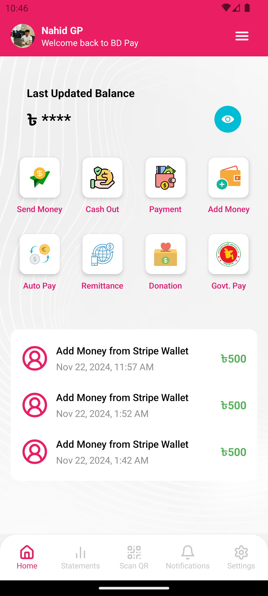
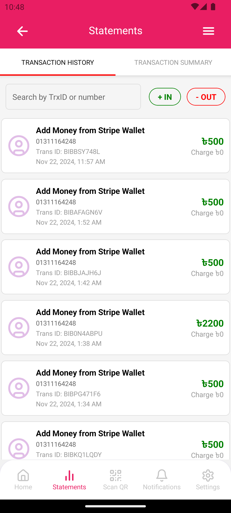
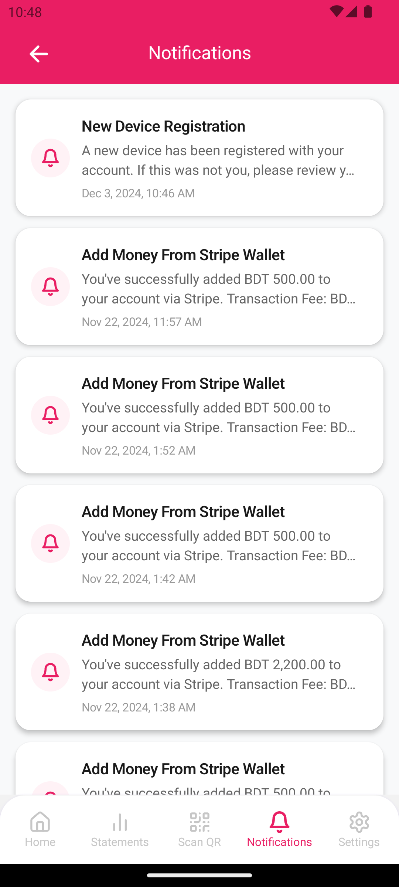
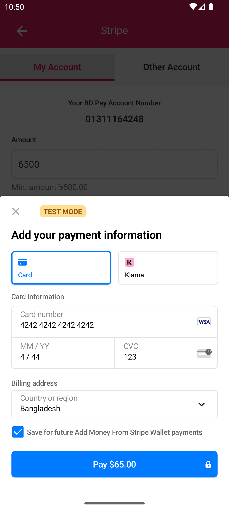
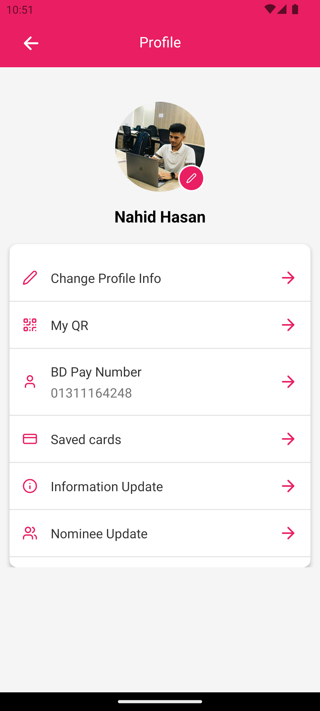

# BD Pay App

A feature-rich mobile payment app enabling seamless money transfers, wallet management, and real-time updates.

---

## 📱 App Features

### 🔒 User Authentication

- Secure login and registration with support for biometric authentication.
- Biometric enable/disable options in profile settings.


---

### 🏠 Home Dashboard

- Real-time updates on wallet balance and recent transactions.
- Intuitive and user-friendly interface for quick actions.



---

### 📋 Account Statements

- Detailed transaction history with real-time filtering options.



---

### 🔔 Notifications

- Instant notifications for all user actions via Firebase.



---

### 💳 Add Money with Stripe

- Secure integration with Stripe for adding funds to wallets.



---

### 🛠️ Profile Management

- Update personal details and preferences.
- Enable or disable biometric authentication.



---

## 🌟 App Highlights

- **Biometric Authentication**: Secure your account with biometric login and enable/disable it easily through profile settings.
- **Add Money with Stripe**: Safely and seamlessly fund your wallet using Stripe's payment gateway.
- **Member-to-Member Money Transfers**: Instantly transfer money between app users.
- **Agent Cashouts**: Cash out directly through nearby agents.
- **QR Code Transfers**: Quick and seamless money transfers using QR codes.
- **Real-Time Updates**: Get notified instantly for every transaction and activity.

---

## 🛠️ Technologies Used

| Technology                 | Purpose                                |
| -------------------------- | -------------------------------------- |
| **Node.js**                | Backend service development.           |
| **Middy**                  | Middleware for AWS Lambda functions.   |
| **AWS Lambda**             | Serverless backend architecture.       |
| **S3**                     | Secure file storage.                   |
| **API Gateway**            | API hosting and management.            |
| **Microservices**          | Scalable and modular architecture.     |
| **CloudWatch**             | Monitoring and logging.                |
| **SQS**                    | Queue services for asynchronous tasks. |
| **Firebase Notifications** | Real-time push notifications.          |
| **React Native**           | Cross-platform mobile app development. |
| **MongoDB**                | Database for scalable data storage.    |

---

### Clone the Repository

1. Open your terminal or command prompt.
2. Run the following command:
   ```bash
   git clone https://github.com/Nahidjc/bd-pay-app.git
   ```
